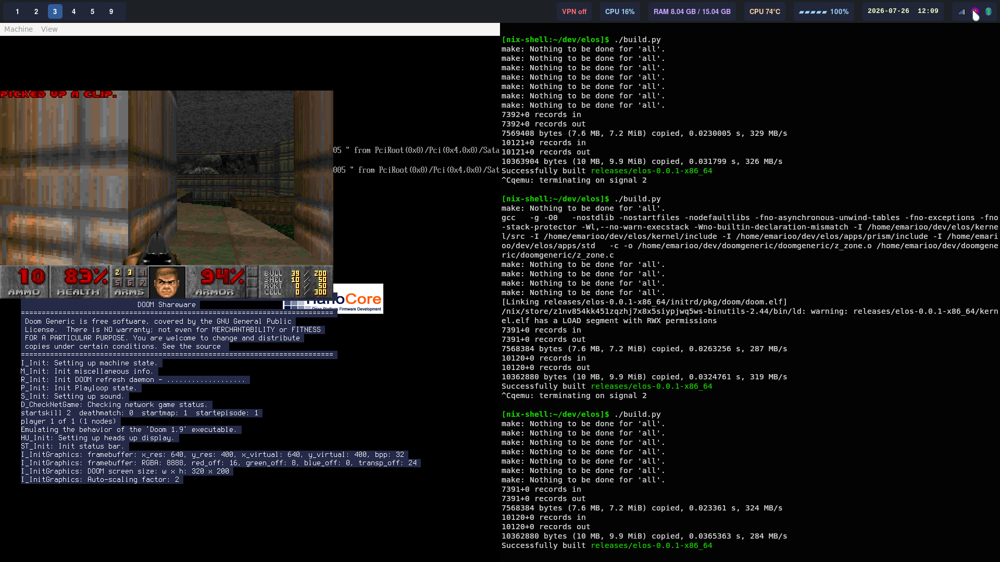
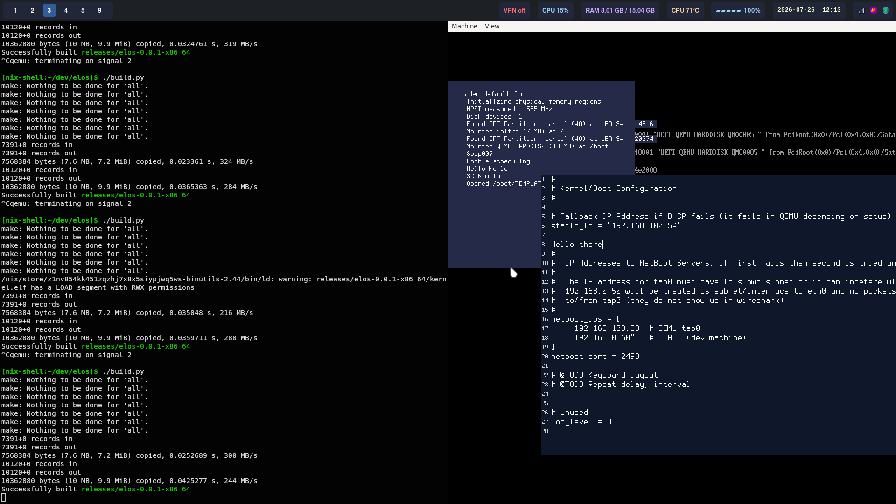

My attempt at kernel/OS development

This project only builds on Linux (Linux has good tools for kernel development).
Personally I use NixOS and Windows Subsystem for Linux.

**DOOM in ELOS (a little buggy, work in progress)**

When building ELOS run `scripts/install_doom.sh` to clone and prepare DOOM repos. `build.py` will build and include DOOM if the repos are present.




**Editor in ELOS**


# Building

```bash
git clone https://github.com/Emarioo/elos
cd elos
scripts/install_deps.sh

./build.py
```

On *NixOS* you must run `nix-shell` before `build.py`.

If you want network in QEMU run `scripts/maketap.sh`. build.py will add network device when starting QEMU and tap0 is found.

Some useful flags to build.py
```bash
# Just run QEMU
./build.py run

# Run QEMU with GDB, uses port 1234 by default
./build.py gdb
# then start gdb
gdb
```

# Flashing OS to USB drive (WIP)

## Windows (WIP)
At the moment ISO doesn't work on Windows alone.
You need WSL (run `build.py install` there).
This installs xorriso which creates ISO file.

As mentioned earlier, you need Rufus on Windows.
Then run below which will make `bin/elos.iso`
```bash
build.py iso
```

Then open Rufus, select USB drive, select iso file and BAM.
You are good to go.
The operating system should not mess with your storage devices except for
the USB drive unless you tell it to. But there may always be bugs
so backup your computer! (I know you're lazy but please do just to be safe)

At the moment `build.py ISO` is a little broken.

There is a way to use `dd`

## Linux (WIP)
You can use the `dd` command to blit a raw image to a USB drive.
The `of` argument is the block device (USB drive) to use.
MAKE SURE YOU PICK THE RIGHT ONE, looking at the size is a good way
to determine which to use.

```bash
build.py img # "build.py" does this by default
lsblk        # shows block devices
sudo dd if=bin/elos.img of=/dev/sda1 bs=512 conv=fsync
```

## Running OS on actual machine
Shutdown your computer.
Plug your flashed USB drive into the computer.
Boot into BIOS by repeatedly pressing DELETE or F2 (F2 is common on ASUS computers).

Then select your USB in BIOS. BIOSes look different but a common thing to search for is "Boot order" or "Boot priority". It may say UEFI beside it which is correct.
If it says Legacy Boot or CSM then it's probably wrong. Modern computers have UEFI so that shouldn't be a problem.

Then press enter or click and it should boot up.

There is a high chance it doesn't boot, this means my OS doesn't follow standards and there is probably nothing you can do about it.


# Some output when booting


```log
Image loaded at: 0x6022000
Hello World
static_ip = 192.168.100.54
netboot_port = 2493
netboot_ips[0] = 192.168.100.50
netboot_ips[1] = 192.168.0.60
BOOT: Found ACPI 1.0, RSDP at 777e000.
BOOT: Found ACPI 2.0, XSDP at 777e014.
No response for DHCP, using static IP address: 192.168.100.54
Did not receive ARP reply. IP doesn't exist or we need to wait longer.
Loading Kernel from disk
UEFI - Exit boot services
Loaded default font
Initializing physical memory regions
MADT LAPIC address: fee00000
MADT flags: 1
LAPIC (type=0 len=8)
 acpiProcessorID: 0
 apicID: 0
 flags: 1
IOAPIC (type=1 len=12)
 ioapicID: 0
 ioapicAddress: fec00000
 globalSystemInterruptBase: 0
IOAPIC int.src.ovr. (type=2 len=10)
 busSource: 0
 irqSource: 0
 globalSystemInterrupt: 2
 flags: 0
IOAPIC int.src.ovr. (type=2 len=10)
 busSource: 0
 irqSource: 5
 globalSystemInterrupt: 5
 flags: d
IOAPIC int.src.ovr. (type=2 len=10)
 busSource: 0
 irqSource: 9
 globalSystemInterrupt: 9
 flags: d
IOAPIC int.src.ovr. (type=2 len=10)
 busSource: 0
 irqSource: 10
 globalSystemInterrupt: 10
 flags: d
IOAPIC int.src.ovr. (type=2 len=10)
 busSource: 0
 irqSource: 11
 globalSystemInterrupt: 11
 flags: d
LAPIC nonmask.int. (type=4 len=6)
 acpiProcessorID: 255
 flags: 0
 LINT: 1
HPET measured: 427886 K cycles/ms
Disk devices: 1
Mounted QEMU HARDDISK (7 MB) at /dev0p0
Searching mounted device QEMU HARDDISK (7 MB)
Found GPT Partition 'part1' (#0) at LBA 34 - 15362
Found file/directory back1.png
STBI parse
Rendered
```

# OS layout

```
|---------------------|
|   BIOS / FIRMWARE   |
|---------------------|
         | |
|---------------------|
|     BOOTLOADER      |
|---------------------|
|       KERNEL        |
|---------------------|
|   Operating System  |
|---------------------|
```


# Resources
- [OS Dev, Wiki](https://wiki.osdev.org/Expanded_Main_Page)
- [nanobyte, Youtube](https://www.youtube.com/playlist?list=PLFjM7v6KGMpiH2G-kT781ByCNC_0pKpPN)
- [Inkbox, Youtube](https://www.youtube.com/watch?v=ZFHnbozz7b4)
